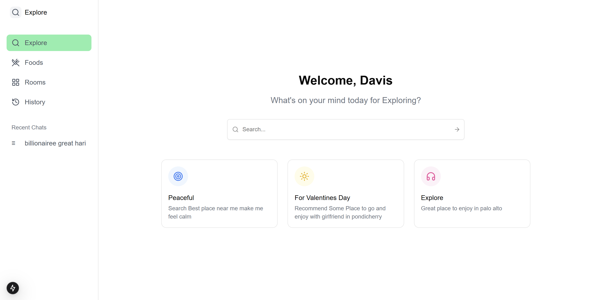

# Explore

---

## Description

- **Search Engine** that helps us to explore the place by understanding user query

#### The Product That we can ask

#### User : Im new to this place can you recommend some good place to near by me

#### User : Craving for biriyani recommend some best rating restrauents (this recommend food card listed in swiggy and order confirmation)

#### User : Im searching for room nearby me and suggest me some room at great rating (this recommend the hotels including booking info through oyo)

## And Many More

---

---

## #Are you solving a real-world problem? (Yes)

#### When moving to a new place or exploring an unfamiliar area, finding reliable recommendations for rooms, restaurants, or attractions can be challenging. Personal experiences, like craving biryani or needing a quick suggestion for a nearby stay, highlight how difficult it can be to make informed decisions without a trustworthy guide.

## 🚀 Our Solution

Explore Nearby is designed to help users navigate their surroundings effortlessly:

- **Local Recommendations:** Quickly discover the best-rated restaurants, rooms, or attractions nearby.
- **Real-Time Data:** Suggestions are dynamically fetched from trusted platforms like Swiggy (for food) and Oyo (for rooms).
- **Personalized Search:** Tailored results based on user preferences and location.

## Are you using PromptRepo?

#### Yes

## Intro

## Flow

## Page

## PromptRepo Google Sheet Link

[travel_dataset](https://docs.google.com/spreadsheets/d/1Pzuc1gkuzFfHjVPGWLL2kH6YSQYXE6Gs0UMX5KLETkc/edit?usp=sharing)

[restaruent_dataset](https://docs.google.com/spreadsheets/d/1rXf4N7Z6W4EdQwAoaaEw5YUe0LyP5qKL9E1yZFb86qQ/edit?usp=sharing)
[rooms(oyo_dataset)](https://docs.google.com/spreadsheets/d/1FDrSjHrX-oG_U7UIRlScQlfTlRAKc1bo-uxppU5rbiM/edit?usp=sharing)

## Model Usage

Search
Classification
Extraction
Generation

## Technology Stack

Rust (Server)
Nextjs (Frontend)
Postgres
PromptRepo

## Team Member

#### [hariprasath](https://github.com/HashiramaSenjuhari)

---

---

# Overview

---

### 🧩 Components Overview

1. **Datasets**:

   - Travel Dataset: For training the **Travel Model**.
   - Swiggy Restaurant Dataset: For training the **Restaurant Model**.
   - Oyo Dataset: For training the **Rooms Model**.

2. **Models**:

   - Travel Model: Handles travel exploration data.
   - Restaurant Model: Optimized for restaurant-related recommendations.
   - Rooms Model: Focuses on accommodation data.

3. **Backend**: A **Rust server** exposes APIs to interact with the models.

   - `/explore`: Handles travel exploration data.
   - `/foods`: Fetches restaurant recommendations.
   - `/rooms`: Provides room accommodation data.

4. **Frontend**: Built with **Next.js** to render dynamic pages based on API responses.

---
